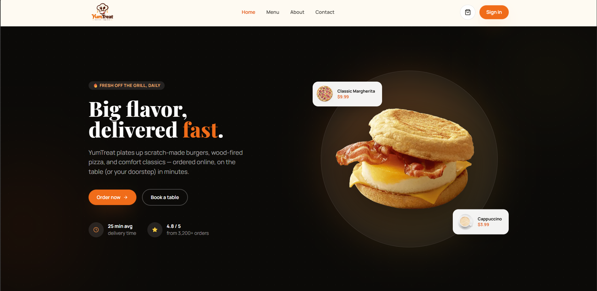
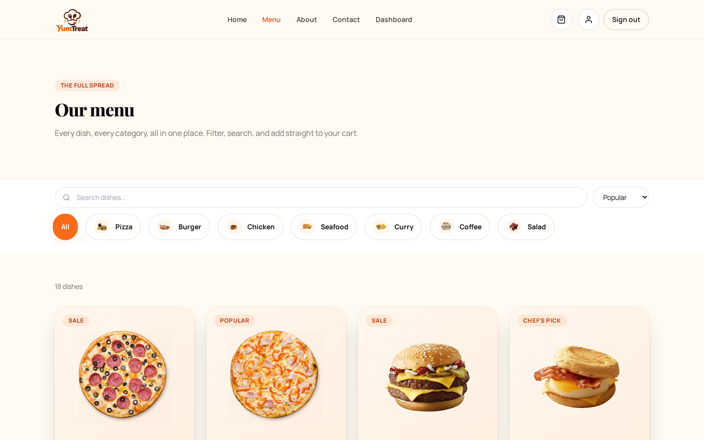
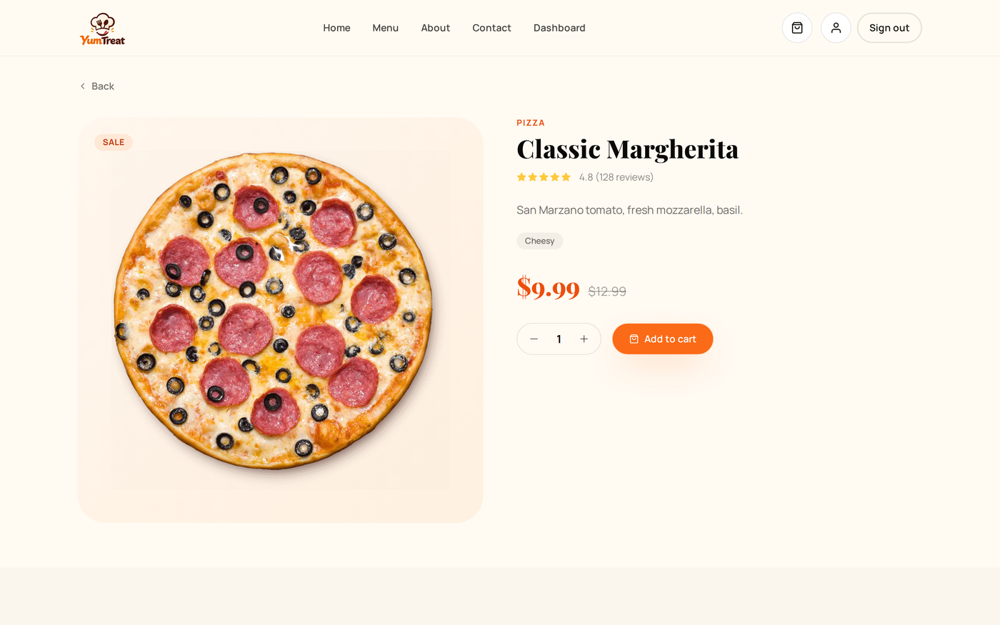
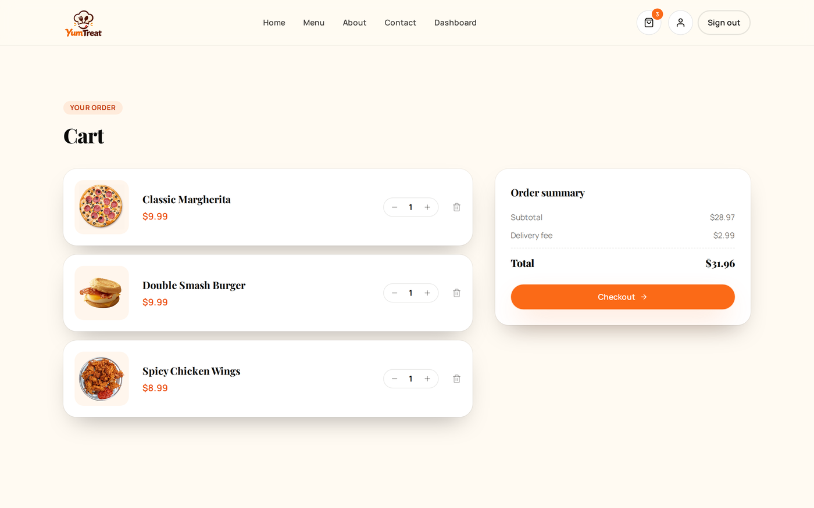
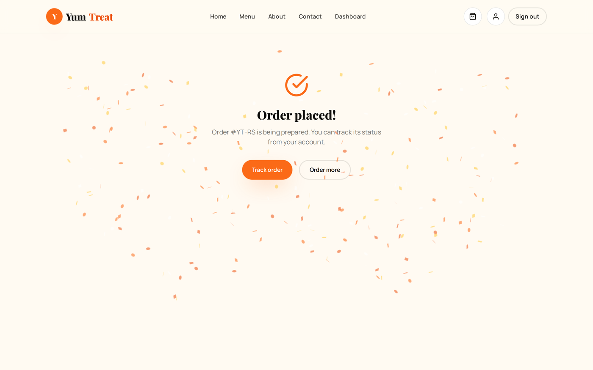
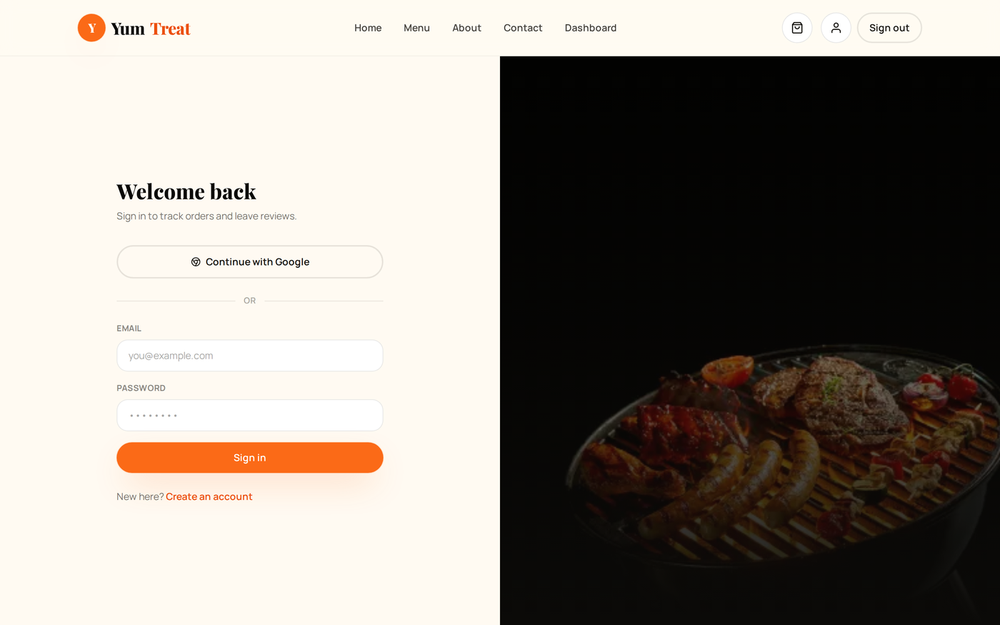
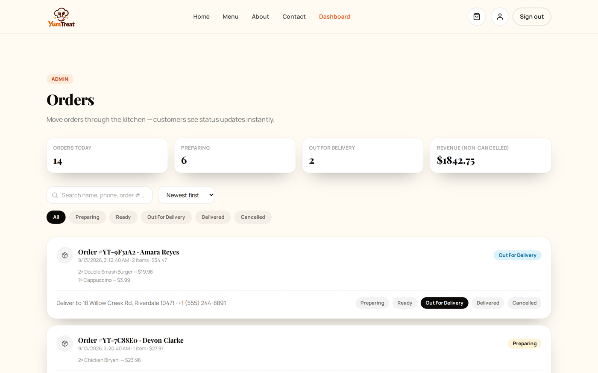

# YumTreat 

A full-stack food ordering platform — browse the menu, add to cart, check out,
and track your order in real time. Built with Next.js (App Router) on the
front end and an Express/MongoDB API on the back end, with **Firebase
Authentication** (email/password + Google) and a "real world" order
management system for the kitchen/admin side.

This README is written for the team — it covers not just how to run the
project, but **where things live and how to change them** so anyone can pick
up a task without archaeology.

---

## Screenshots

| | |
|---|---|
|  |  |
| **Home** — animated hero, categories, popular dishes | **Menu** — search, category filter, sort |
|  |  |
| **Food detail** — reviews, related dishes, add to cart | **Cart** — live quantity updates, order summary |
|  |  |
| **Checkout** — confetti + confirmation on order placed | **Sign in** — Firebase email/password + Google |
|  | |
| **Admin dashboard** — live stats, search/filter, status pipeline | |

More screenshots live in [`/docs`](./docs).

---

## Tech stack

| | |
|---|---|
| **Frontend** | Next.js 14 (App Router), React 18, Tailwind CSS, Framer Motion, Axios |
| **Backend** | Node.js, Express, MongoDB (Mongoose) |
| **Auth** | Firebase Authentication (client) + Firebase Admin SDK (server-side token verification) |
| **Extras** | canvas-confetti, react-icons |

---

## Getting started

You'll need Node.js 18+, a MongoDB database (local or [Atlas](https://www.mongodb.com/atlas)),
and a [Firebase project](https://console.firebase.google.com/) with **Email/Password**
and **Google** sign-in enabled (Authentication → Sign-in method).

### 1. Backend

```bash
cd backend
npm install
cp .env.example .env
# fill in MONGO_URI, FIREBASE_PROJECT_ID / FIREBASE_CLIENT_EMAIL / FIREBASE_PRIVATE_KEY,
# and ADMIN_EMAILS (see backend/README.md for exactly where to find these)
npm run dev    # http://localhost:5000
```

That's the only command you need — an empty database is seeded automatically
on first boot (see [Auto-seeding](#auto-seeding) below).

### 2. Frontend

```bash
cd frontend
npm install
cp .env.example .env
# fill in the NEXT_PUBLIC_FIREBASE_* values from your Firebase web app config
npm run dev    # http://localhost:3000
```

### 3. Get admin access

Sign up on the site with an email that's listed in `ADMIN_EMAILS` in
`backend/.env`. The backend promotes that account to `admin` automatically
on sign-in — no manual database editing required.

Full API reference, data model notes, and auth flow details are in
[`backend/README.md`](./backend/README.md).

---

## Project structure

```
yumtreat/
├── backend/
│   ├── src/
│   │   ├── config/       db.js (Mongo connection), firebaseAdmin.js (Admin SDK init)
│   │   ├── middleware/   auth.js (token verification + admin guard), errorHandler.js
│   │   ├── models/       Mongoose schemas — User, Food, Category, Order, Review
│   │   ├── controllers/  one file per resource; all business logic lives here
│   │   ├── routes/       route → controller wiring, one file per resource
│   │   └── seed/         seedData.js (raw data), seedDatabase.js (reusable logic),
│   │                     seed.js (CLI wrapper for manual reset)
│   └── server.js         entrypoint — connects DB, auto-seeds if empty, starts Express
│
├── frontend/
│   ├── app/               pages, following the App Router file-based routing convention.
│   │                      Each folder under app/ is a route; page.jsx is what renders.
│   │   ├── admin/         admin-only pages (wrapped in <AdminGuard>)
│   │   ├── menu/[id]/     dynamic route — food detail page
│   │   └── ...            one folder per top-level route (cart, checkout, account, etc.)
│   ├── components/        shared UI pieces used across pages
│   │   └── motion/        animation helpers (Reveal, StaggerReveal, CountUp, PageTransition)
│   ├── context/           React Context providers — AuthContext, CartContext
│   ├── lib/                api.js (axios client + every backend call), firebase.js (client SDK init)
│   └── public/images/     static assets (food photos, category icons, logo)
│
└── docs/                  screenshots used in this README
```

**Rule of thumb for where new code goes:**
- New page → new folder under `frontend/app/`
- New reusable UI piece used on 2+ pages → `frontend/components/`
- New backend resource (e.g. "coupons") → one model, one controller, one routes file, wired into `backend/server.js`
- New animation pattern → `frontend/components/motion/`, so it's reusable rather than copy-pasted

---

## Design system

Everything below is defined in `frontend/tailwind.config.js` and
`frontend/app/globals.css`. **Change colors/spacing/fonts there, not by
hardcoding hex values in components** — that's what keeps the site
consistent as more people touch it.

### Colors

| Token | Hex | Used for |
|---|---|---|
| `ember-500` | `#fb6a17` | Primary brand color — buttons, links, price tags, active states |
| `ember-600` | `#ec4f0d` | Hover state for ember-500, "Treat" in the wordmark |
| `ember-50`–`ember-900` | — | Full tint/shade ramp for badges, backgrounds, borders at low opacity |
| `saffron` | `#ffc93c` | Secondary accent — star ratings, small highlights |
| `ink-950` | `#0b0a08` | Near-black — dark section backgrounds (hero, footer, testimonials) |
| `ink-900` | `#14120e` | Primary body text color |
| `ink-800` / `ink-700` | — | Lighter dark-mode-adjacent shades, rarely used directly |
| `cream` | `#fffaf2` | Page background (the site's "paper" color, not pure white) |

Use these as Tailwind classes: `bg-ember-500`, `text-ink-900/60` (the `/60` is
opacity — used constantly for secondary/muted text instead of a separate
gray palette).

### Typography

Two font variables, wired up in `app/layout.jsx` via `next/font/google` and
consumed through CSS variables so Tailwind can reference them:

- `font-display` (Playfair Display, serif) — all headings (`h1`–`h4` get this
  automatically via a global rule in `globals.css`), and anything that should
  feel editorial/branded
- `font-body` (Manrope, sans-serif) — default body text

### Reusable classes (`globals.css`)

Instead of rebuilding buttons/cards from scratch, use these utility classes
(defined with `@apply` in `globals.css`):

| Class | What it's for |
|---|---|
| `.btn-primary` | Solid ember button — main call-to-action |
| `.btn-outline` | Bordered button — secondary action |
| `.btn-ghost-light` | White-bordered button for use on dark backgrounds |
| `.card` | White rounded panel with soft shadow — the base for most content blocks |
| `.badge` | Small pill label (e.g. "Popular", "Sale", "Chef's pick") |
| `.input-field` | Text input / textarea / select styling |
| `.section-pad` | Standard vertical padding for a full-width page section |
| `.container-x` | Standard max-width + horizontal padding wrapper |

If you need a new visual pattern that will be reused, add it here rather than
repeating a long Tailwind class string across multiple files.

### Animation system

Built on **Framer Motion**, with shared helpers in `components/motion/` so
new sections don't need bespoke animation code:

- `<Reveal>` — fades/slides a block in when it scrolls into view
- `<StaggerReveal>` + `<StaggerItem>` — reveals a grid/list with each child
  animating in slightly after the last (used for the menu grid, feature
  cards, testimonials, etc.)
- `<CountUp>` — animates a number counting up when it scrolls into view (used
  in the stats bar)
- `<PageTransition>` — wraps every page in `app/layout.jsx` for the
  fade/slide transition between routes

Most hover/tap interactions use inline `whileHover` / `whileTap` props
directly on a `motion.div`/`motion.button` rather than a shared helper —
that's intentional, since those are usually one-off per component.

### Logo & favicon

- `frontend/app/favicon.ico` — browser tab icon (Next.js auto-detects this
  location, no config needed)
- `frontend/public/images/logo-lockup.png` — the icon + "YumTreat" wordmark
  (no tagline), used as-is in the Navbar and Footer. **This is a flat image,
  not a component with separate text** — if the wordmark needs to change,
  a new image needs to be generated, not edited in JSX.
- `frontend/public/images/logo-icon.png` — just the chef-hat mark, no text,
  for places that need a small square icon
- `frontend/public/images/logo.png` — the full original square lockup
  including the tagline, kept for reference/other uses

---

## How the main flows work

### Auth (Firebase)

1. Frontend signs the user in/up directly against Firebase (email/password
   or Google) via the client SDK in `lib/firebase.js` — no request to the
   backend for this step.
2. `AuthContext` (`context/AuthContext.jsx`) listens for Firebase auth state
   changes and calls `GET /api/auth/account` with the Firebase ID token.
3. The backend's `requireAuth` middleware (`backend/src/middleware/auth.js`)
   verifies that token with the Firebase Admin SDK, then finds-or-creates a
   matching local `User` document — this is also where `role` (`user` /
   `admin`) is decided, based on `ADMIN_EMAILS` in `backend/.env`.
4. `lib/api.js`'s axios interceptor attaches a fresh ID token to every
   request automatically — components never handle tokens directly.

### Cart

Client-side only, no backend involvement until checkout. `CartContext`
(`context/CartContext.jsx`) holds items in state and mirrors them to
`localStorage` (key `yumtreat_cart`) so the cart survives a refresh.

### Placing an order

`checkout/page.jsx` sends item ids + quantities to `POST /api/orders/place`.
**The backend recalculates the price from the live `Food` documents** — it
never trusts a client-sent total. Each order stores a *snapshot* of the
items (name/price/image at that moment), so old orders stay accurate even if
a dish's price changes later.

### Order status pipeline

`preparing → ready → out_for_delivery → delivered` (or `cancel` at any point
before `delivered`). Every transition is appended to `Order.statusHistory`.
Once `delivered` or `cancel`, the order is locked — see
`backend/src/controllers/orderController.js`.

### Admin access

`components/AdminGuard.jsx` wraps every page under `app/admin/` and checks
`isAdmin` from `AuthContext`; it shows a sign-in prompt instead of the page
if the user isn't an admin. The backend enforces the same thing
independently via `requireAdmin` middleware — the frontend guard is just for
UX, not the actual security boundary.

<a name="auto-seeding"></a>
### Auto-seeding

`backend/server.js` checks on every startup whether `Category`/`Food` are
empty and, if so, seeds ~7 categories and ~54 foods from
`backend/src/seed/seedData.js`. It's a no-op once data exists, so it's safe
to leave in place — there's no separate seed step for local dev. Use
`npm run seed` / `npm run seed:destroy` only if you want to deliberately
wipe and reset back to demo data.

---

## Environment variables

### `backend/.env`

| Variable | What it's for |
|---|---|
| `MONGO_URI` | MongoDB connection string |
| `PORT` | API port (defaults to 5000) |
| `CORS_ORIGIN` | Comma-separated list of origins allowed to call the API |
| `FIREBASE_PROJECT_ID` / `FIREBASE_CLIENT_EMAIL` / `FIREBASE_PRIVATE_KEY` | Firebase Admin SDK service account credentials — from Firebase console → Project settings → Service accounts |
| `ADMIN_EMAILS` | Comma-separated emails auto-promoted to `admin` on sign-in |

### `frontend/.env`

| Variable | What it's for |
|---|---|
| `NEXT_PUBLIC_API_URL` | Backend API base URL (e.g. `http://localhost:5000/api`) |
| `NEXT_PUBLIC_FIREBASE_*` | Firebase **web app** config (public/client-safe) — from Firebase console → Project settings → General → Your apps |

Both `.env.example` files have the full list with comments — copy them to
`.env` and fill in real values.

---

## Notes for contributors

- **Never hardcode a color** — use the Tailwind tokens above. If a new color
  is genuinely needed, add it to `tailwind.config.js` first.
- **The backend is the source of truth for prices/totals.** If you touch
  checkout or admin order logic, keep that server-side calculation intact —
  don't reintroduce trusting a client-sent price or total.
- **New backend routes need explicit auth.** Copy the pattern in an existing
  routes file (`requireAuth`, `requireAdmin` from `middleware/auth.js`) —
  don't assume a route is safe just because the frontend doesn't expose it
  publicly.
- **Screenshots in `/docs` are real captures**, not mockups. If you make a
  significant visual change, regenerate them so the README stays honest.
- Full backend API reference (every route, request/response shape, data
  model notes) is in [`backend/README.md`](./backend/README.md) — check
  there before adding a new endpoint, to match existing conventions.
